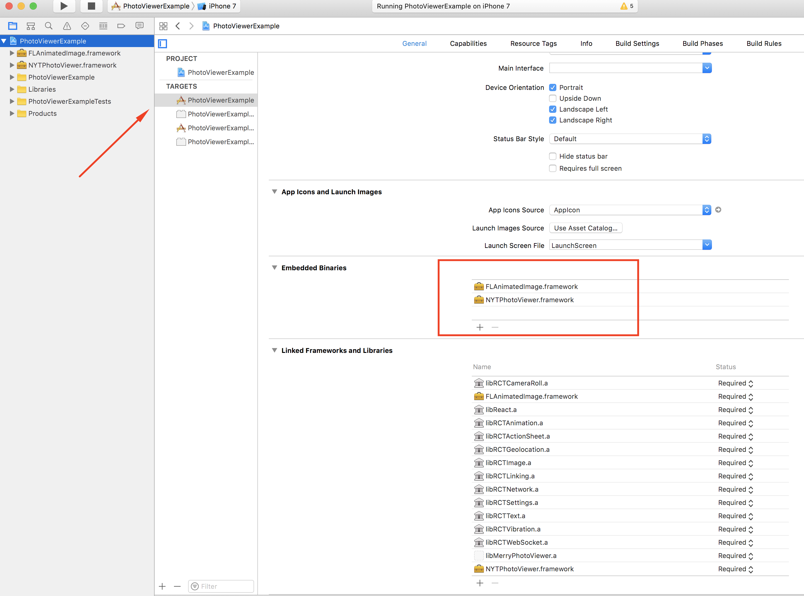

# @merryjs/photo-viewer[WIP]

> A photo viewer for react native build on top of NYTPhotoViewer and
- [@merryjs/photo-viewer[WIP]](#merryjs-photo-viewer-wip)
    - [Getting started](#getting-started)
        - [Mostly automatic installation](#mostly-automatic-installation)
        - [Manual installation](#manual-installation)
            - [iOS](#ios)
            - [IOS Link Frameworks](#ios-link-frameworks)
                - [Manual link](#manual-link)
                - [[CocoaPods](https://cocoapods.org/)](#cocoapods-https-cocoapods-org)
                - [[Carthage](https://github.com/Carthage/Carthage)](#carthage-https-github-com-carthage-carthage)
            - [Android](#android)
    - [Usage](#usage)
    - [LICENSE](#license)


## Getting started

`$ npm install @merryjs/photo-viewer --save`

or

`$ yarn add  @merryjs/photo-viewer`

### Mostly automatic installation

`$ react-native link @merryjs/photo-viewer`

When you done this you still need link some frameworks into your xcode's embedded framework section,
here you have some choices please see [IOS link frameworks](#ios-link-frameworks) for more details


### Manual installation


#### iOS

1. In XCode, in the project navigator, right click `Libraries` ➜ `Add Files to [your project's name]`
2. Go to `node_modules` ➜ `@merryjs/photo-viewer` and add `MerryPhotoViewer.xcodeproj`
3. In XCode, in the project navigator, select your project. Add `libMerryPhotoViewer.a` to your project's `Build Phases` ➜ `Link Binary With Libraries`
4. Run your project (`Cmd+R`)<

#### IOS Link Frameworks

##### Manual link

For some reasons if you dont want use any package manager in your side then you can link frameworks as:

- Go to your xcode project choose your project if you unsure it click (command + 1)
- Choose target General panel find embedded binaries click + icon will display a dialog and then go to `node_modules/@merryjs/photo-viewer/ios/Carthage/Build/iOS/` folder add these frameworks into your xcode project. It should looks like below
	

##### [CocoaPods](https://cocoapods.org/)

TODO: If you want use CocoaPods you can go to these repo find out how to integrated with cocoapods, i have not try this in the example repo

##### [Carthage](https://github.com/Carthage/Carthage)

If you want use Carthage in your project and then you can add these dependencies into your Cartfile

```

github "NYTimes/NYTPhotoViewer" "develop"
github "rs/SDWebImage"

```
and run `carthage update` when you done this you can link it like Manual link from node_modules describes, the only difference is use your carthage file instead of ours

#### Android

1. Open up `android/app/src/main/java/[...]/MainActivity.java`
  - Add `import com.reactlibrary.MerryPhotoViewerPackage;` to the imports at the top of the file
  - Add `new MerryPhotoViewerPackage()` to the list returned by the `getPackages()` method
2. Append the following lines to `android/settings.gradle`:
  	```
  	include ':@merryjs/photo-viewer'
  	project(':@merryjs/photo-viewer').projectDir = new File(rootProject.projectDir, 	'../node_modules/@merryjs/photo-viewer/android')
  	```
3. Insert the following lines inside the dependencies block in `android/app/build.gradle`:
  	```
      compile project(':@merryjs/photo-viewer')
  	```


## Usage

The most part from this package is setup the Native side dependencies, once you have done it before,
you can use it as below, very very easy to use:

```javascript

import photoViewer from '@merryjs/photo-viewer';

photoViewer.show(options)

```

At this moment, only two methods you need to call
- `show` for display the photo viewer
- `hide` for hide the photo viewer, but most case you just need `show` it.

## LICENSE

```

Copyright 2017 Merryjs.com

Licensed under the Apache License, Version 2.0 (the "License");
you may not use this file except in compliance with the License.
You may obtain a copy of the License at

	http://www.apache.org/licenses/LICENSE-2.0

Unless required by applicable law or agreed to in writing, software
distributed under the License is distributed on an "AS IS" BASIS,
WITHOUT WARRANTIES OR CONDITIONS OF ANY KIND, either express or implied.
See the License for the specific language governing permissions and
limitations under the License.

```


Due to we use some third-part softwares and both of them are licensed under Apache 2.0 so do we.

- [Photo Viewer](https://github.com/merryjs/photo-viewer/blob/master/LICENSE)
- [NYTPhotoViewer](https://github.com/NYTimes/NYTPhotoViewer/blob/develop/LICENSE.md)
- [FrescoImageViewer](https://github.com/stfalcon-studio/FrescoImageViewer#license)
